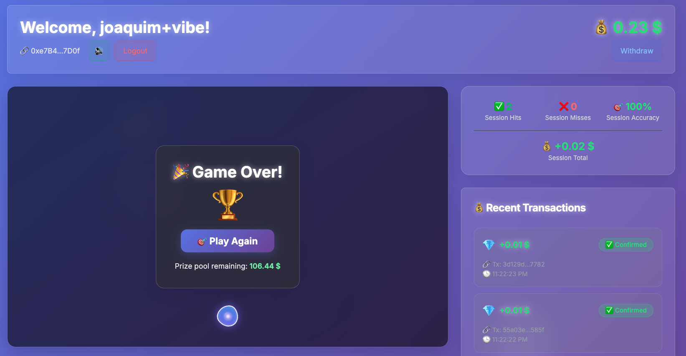

# Vibe shooter

Vibe Shooter is a fully vibe-coded Next.js web game powered by the [AI-optimized thirdweb API](https://api.thirdweb.com/reference) which handles authentication, wallet management, gasless transactions, and more.



View the full thirdweb documentation on the [thirdweb portal](https://portal.thirdweb.com).

## How to vibe code

- Add the [thirdweb API `llms.txt`](https://api.thirdweb.com/llms.txt) to your repo or prompt context and start prompting.
- Build features by prompting against your codebase + `llms.txt`. The thirdweb API covers user authentication, wallet management, gasless transactions, and more out of the box.
- Reference endpoints and capabilities in the [thirdweb API reference](https://api.thirdweb.com/reference).

## Features

- **User Authentication**: Email OTP login creates a wallet automatically
- **Persistent Sessions**: Your account is remembered - no need to re-enter details on reload
- **Clicking Game**: Click on randomly spawning targets within a 10-second timer
- **Token Rewards**: Earn 0.01 tokens for each target hit
- **Real-time Transactions**: See transaction status updates in real-time
- **Balance Tracking**: View your current token balance with auto-refresh
- **Account Switching**: Log out and log in with a different email anytime
- **Responsive Design**: Built with Tailwind CSS and shadcn components

## Tech Stack

- **Frontend**: Next.js 14 with App Router, TypeScript, Tailwind CSS
- **UI Components**: shadcn/ui components
- **Blockchain Integration**: thirdweb API
- **Styling**: Tailwind CSS with custom game animations

## Run the code

1. **Install Dependencies**

   ```bash
   pnpm install
   ```

2. **Environment Configuration**

   - Copy `env.template` to `.env.local`:

   ```bash
   cp env.template .env.local
   ```

   - Fill in your environment variables in `.env.local`:

   ```env
   THIRDWEB_SECRET_KEY=your_thirdweb_secret_key_here
   TREASURY_WALLET_ADDRESS=0x...
   THIRDWEB_API_BASE_URL=https://api.thirdweb.com
   ```

3. **Required Setup**

   - Get your thirdweb secret key from the [thirdweb dashboard](https://thirdweb.com/dashboard)
   - Deploy or have access to an ERC-20 token contract
   - Your treasury wallet should be a server wallet. You can create one on your thirdweb dashboard. Ensure it has sufficient token balance.

4. **Run the Development Server**

   ```bash
   pnpm dev
   ```

5. **Open the Game**
   - Navigate to `http://localhost:3000`
   - Enter your email and verify the 6-digit code to create your wallet and start playing

## Environment Variables

| Variable                  | Description                                         |
| ------------------------- | --------------------------------------------------- |
| `THIRDWEB_SECRET_KEY`     | Your thirdweb secret key for backend authentication |
| `TREASURY_WALLET_ADDRESS` | Wallet address that holds and distributes tokens    |
| `THIRDWEB_API_BASE_URL`   | thirdweb API base URL                               |

## Game Rules

1. **Login**: Enter a username to create your wallet (remembered for future visits)
2. **Start Game**: Click "Start Game" to begin a 10-second round
3. **Hit Targets**: Click on red targets that appear randomly
4. **Earn Tokens**: Each target hit earns 0.01 tokens
5. **Track Progress**: View your balance and transaction history
6. **Play Again**: Start new rounds to earn more tokens
7. **Switch Account**: Use "Switch Account" to log in with a different username

## Architecture

### API Routes

- `POST /api/auth/send-code` - Send email OTP
- `POST /api/auth/verify-code` - Verify OTP and create session
- `POST /api/auth/logout` - Clear session cookies
- `GET /api/balance?address=0x...` - Get a wallet's token balance
- `GET /api/treasury-balance` - Get treasury wallet token balance
- `POST /api/reward` - Send tokens from treasury to player (on hit)
- `POST /api/penalty` - Send tokens from player to treasury (on miss)
- `POST /api/withdraw` - Withdraw a player's full balance to a recipient
- `GET /api/transaction/[id]` - Get transaction status
- `GET /api/transactions` - List recent transactions
- `GET /api/leaderboard` - Show top score holders

### thirdweb Integration

All thirdweb API logic is contained in [`src/lib/thirdweb.ts`](src/lib/thirdweb.ts). This file uses the thirdweb API to perform wallet operations, contract reads/writes, token transfers, transaction queries, and leaderboard data.

## Customization

### Game Settings

Edit the constants in `src/components/game/game-arena.tsx`:

```typescript
const GAME_DURATION = 10000; // 10 seconds
const TARGET_SPAWN_INTERVAL = 2000; // 2 seconds
const TARGET_LIFETIME = 3000; // 3 seconds
```

### Reward/Penalty Amounts

Reward and penalty amounts are specified in token units within their respective API routes and then converted to base units. Token address, decimals, and chain ID are configured in `src/lib/constants.ts`.

## Troubleshooting

1. **Wallet Creation Fails**: Check your thirdweb secret key
2. **No Tokens Received**: Ensure treasury wallet has sufficient balance
3. **Transaction Failures**: Verify token contract address and chain ID
4. **Balance Not Updating**: Check API connectivity and refresh manually

## Contributing

1. Fork the repository
2. Create a feature branch
3. Make your changes
4. Submit a pull request

## License

Apache 2.0. This project is for educational purposes.
